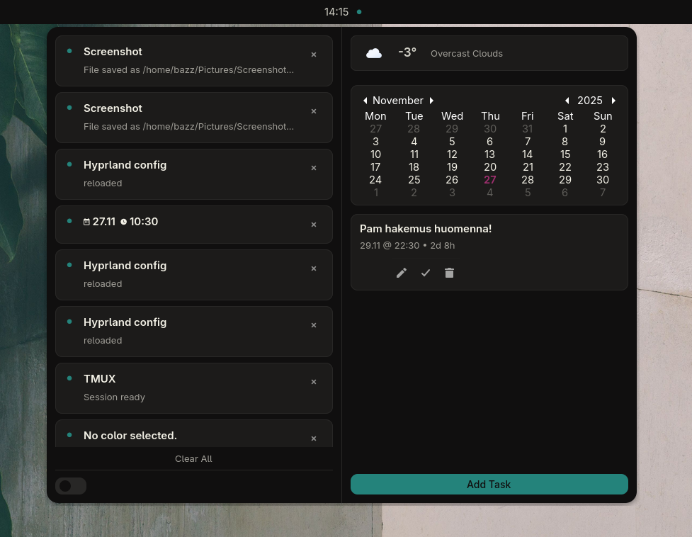
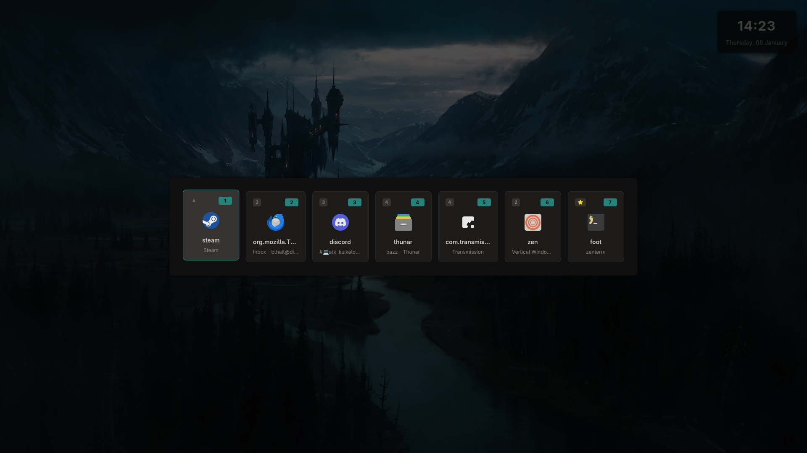

# My Ignis Shell (WIP)

_A modular Hyprland shell powered by Ignis_

> ⚠️ **Status VERY Work in Progress**
>
> My first ever python project so don't kill me...
>
> This shell main functions should work with **Niri** too, but some modules may need some work
>
> If **you** have more experience from Python and wan't to improve my build don't hesitate to make PR ☺️

## Overview

This is my custom Wayland shell built on **Ignis**, featuring bar, notification system, launcher, OSD components.

The goal is to keep things **clean, minimal, event-driven, and lightweight**, while being easy to extend and hack on.

Dependencies: check my [dotfiles](https://github.com/bitterhalt/dotfiles)

## Features (WIP)

### 🔸 Bar

- Clock
- Power menu
- Network & system indicators
- Record indicator

### 🔸 OSD

- Audio
- Simple Media OSD with artwork
- Workspaces on barless mode
- Build-in Notifications

### 🔸 Menus

- Notification history
- Quick settings
- Weather
- Power
- Screenshots
- Window Switcher

### 🔸 Extra Integrations

- Barless mode

## Some screenshots

> Empty desktop
> 
>
> Without bar workspace overlay popup
> 

<b>Notification Center</b>
 

<b>Weather</b>
 

<b>Window-list</b>
 

## TODO

> _30.12.25_

- [ ] Styles are at mess! Make some tidying for values + maybe add few more themes
- [ ] Support to use dynamic theming with matugen. This is way out my skills so (help is needed)
- [ ] Full Niri support (help needed)
- [x] In settings: add option to remember bar state after restart
- [x] add bluetooth in panel
- [x] add small time stamps to notifications
- [x] Parts of of notications are super ugly -> fix when rainy day

#### Special thanks ⭐

> This build would not exist without these! I beraly understand Python but I can put pieces together once I stole others ideas.

- [Linkfrg](https://github.com/ignis-sh/ignis) and his [dotfiles](https://github.com/linkfrg/dotfiles)
- [debuggyo](https://github.com/debuggyo) and [Exo](https://github.com/debuggyo/Exo)
- [tr1x_em](https://github.com/tr1xem) and [flux](https://github.com/tr1xem/flux)
- [lost-melody](https://github.com/lost-melody/) and his [build](https://github.com/lost-melody/IgnisNiriShell)
