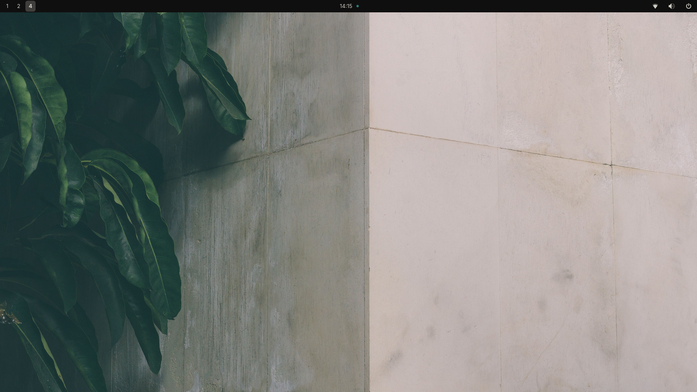
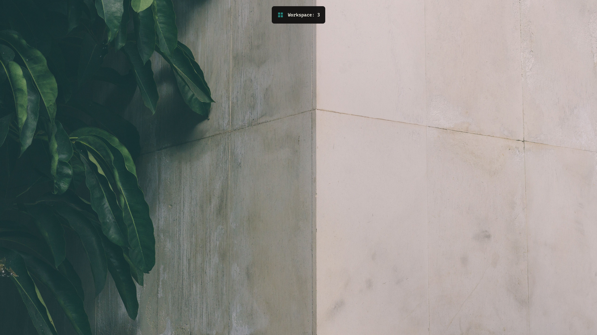
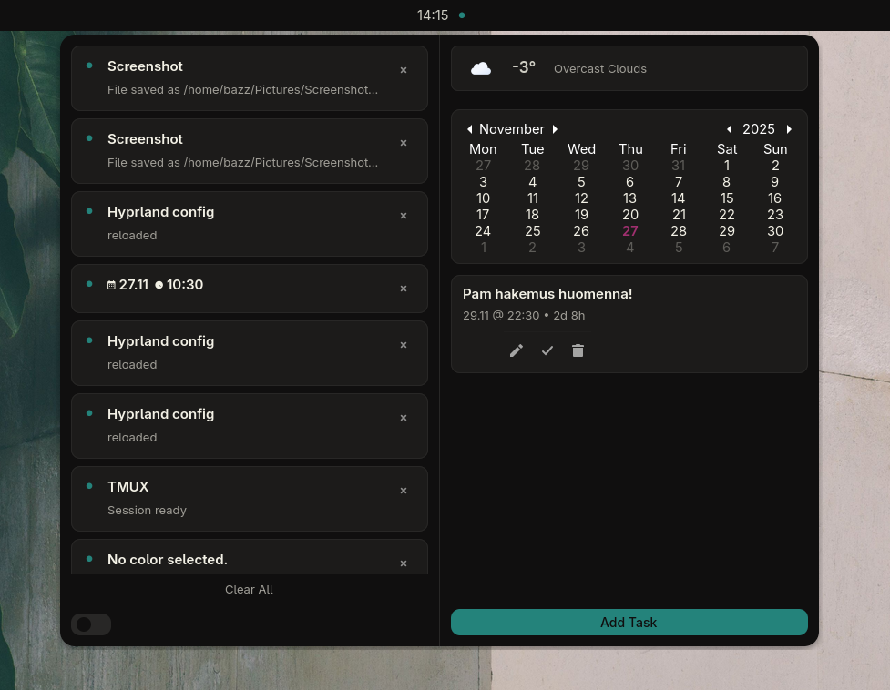
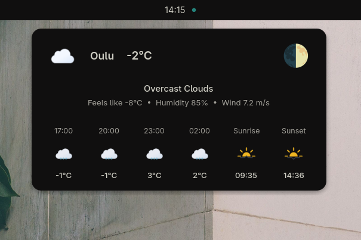

# My Ignis Shell (WIP)

_A modular Wayland shell powered by Ignis_

> ⚠️ ** Status VERY Work in Progress**
>
> My first ever python project so don't kill me...

## Overview

This is my custom Wayland shell built on **Ignis**, featuring bar, notification system, launcher, OSD components.

The goal is to keep things **clean, minimal, event-driven, and lightweight**, while being easy to extend and hack on.

This is made for me, so there are no graphical setting UI's because: 1. I don't need them, 2. I have zero skill to build them 🤪

Dependencies: check my [dotfiles](https://github.com/bitterhalt/dotfiles)

## Features (WIP)

### 🔸 Bar

- Workspaces (supports Hyprland & Niri)
- Clock
- Power menu
- Network & system indicators
- Record indicator etc
- Weather
- Notifications

### 🔸 OSD

- Audio
- Workspaces on barless mode
- Submaps (Hyprland)
- Power menu
- Notifications

### 🔸 Launcher

- App runner with fuzzy search
- Calculator
- Emoji support
- Websearch (WIP)

### 🔸 Extra Integrations

- Barless mode

## Some screenshots

> Empty desktop
> 
>
> Without bar workspace overlay popup
> 

<b>Notification Center</b>
 

<b>Weather</b>
 

## TODO

> _01.12.27_

- [ ] adapt new window_manager.api
- [ ] add some settings to control ignis, just simple things like restart etc.
- [ ] add bluetooth in panel, easy but I don't have any bt devices atm :D
- [ ] cleanup the code and make syntax more consistenta
- [ ] add small time stamps to notifications
